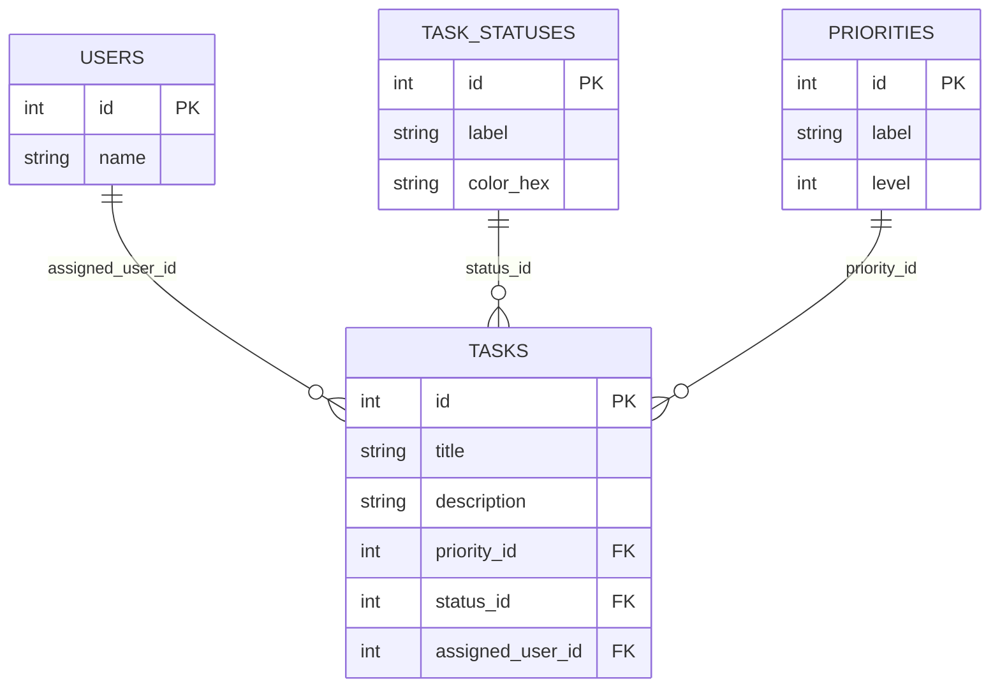
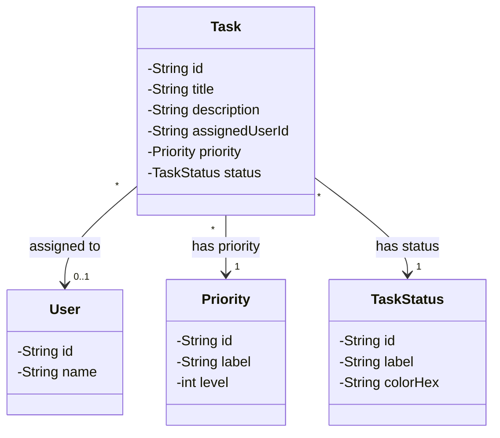

# Gestor de Tareas Avanzado (TaskFlow)

Este es un sistema de gestión de tareas diferente, rediseñado desde cero para aplicar conceptos avanzados de Programación Orientada a Objetos (POO), principios SOLID, uso de interfaces para abstraer la persistencia y conexión a base de datos mediante JDBC.

## Arquitectura y Principios Aplicados

El proyecto fue construido tomando en cuenta:
1. **POO y Abstracciones**: Uso de interfaces DAO (`IGenericDAO`, `ITaskDAO`, `IUserDAO`) para desacoplar la lógica de negocio de la implementación técnica de acceso a datos.
2. **SOLID (Principio de Inversión de Dependencias)**: El núcleo del sistema (ej. `TaskManager`) no depende de clases concretas, sino de abstracciones (interfaces), lo cual hace al sistema escalable y fácil de mantener.
3. **JDBC**: Implementación segura de persistencia con bases de datos MySQL, manejando transacciones y cierres de recursos adecuadamente.

---

## 1. Flujo Conceptual y Modelo Entidad-Relación (E-R)

### Flujo Conceptual del Sistema

### Modelo Entidad-Relación (E-R) / Lógico
El sistema gestiona Tareas (`Tasks`), Usuarios (`Users`), Estados (`TaskStatus`) y Prioridades (`Priority`). El modelo está diseñado y normalizado hasta la Cuarta Forma Normal (4NF) para asegurar integridad referencial y evitar dependencias multivaluadas.

---

## 2. Diagrama UML de Clases

La estructura en código orientada a objetos (POO) del sistema mapea el flujo de trabajo de la siguiente manera:

---

## 3. Base de Datos (Modelo Físico y Normalización)

### Diagrama del Modelo Físico (DrawSQL / DrawMySQL)

### Normalización (hasta 4NF)
- **1NF**: Columnas con valores atómicos (sin listas u objetos anidados en campos).
- **2NF**: No hay dependencias parciales dado que usamos una clave primaria simple (`id`).
- **3NF**: No hay dependencias transitivas; los datos paramétricos como los colores de los estados o niveles de prioridades están extraídos en sus propias tablas paramétricas (`task_statuses` y `priorities`).
- **4NF**: Se cumple, ya que no hay dependencias multivaluadas en una sola tabla de enlace (cada tarea tiene máximo un usuario, estado y prioridad).

### Reconstruir en DrawSQL / DrawMySQL
Para generar el modelo físico con exactitud:
1. Abre [DrawSQL](https://drawsql.app/).
2. Haz clic en **Import from SQL**.
3. Pega el contenido del script que encontrarás en `database.sql` dentro de este proyecto.

### Conexión Mediante DBeaver
1. En DBeaver, crea una nueva conexión **MySQL**.
2. Ingresa `localhost` como servidor y `3306` como puerto.
3. Conéctate con tu usuario/contraseña (ej. `root`).
4. Abre el editor SQL y corre el script `database.sql` para crear la base de datos `taskflow_db` y sus tablas.

---

## Ejecutar la Aplicación

1. Asegúrate de tener tu servidor MySQL activo (XAMPP, MySQL Installer, o Docker) y ejecutar primero `database.sql`.
2. Puedes compilar el proyecto usando `compile.bat`.
3. Ejecútalo mediante `run.bat`.
