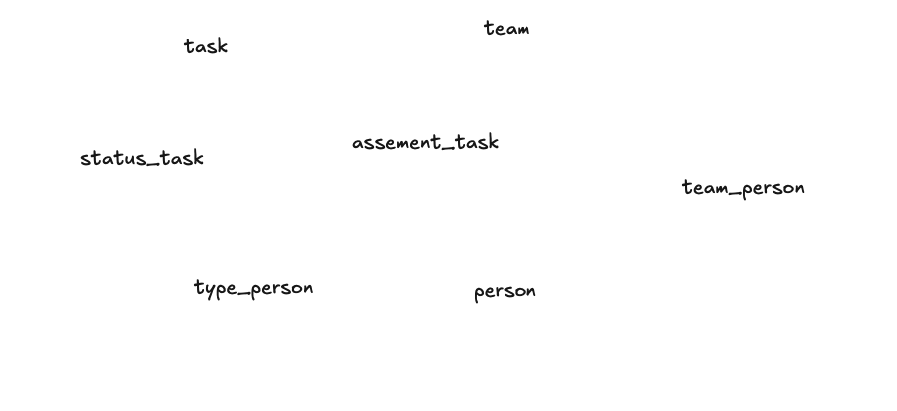
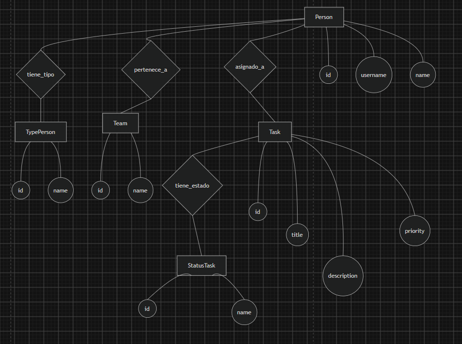
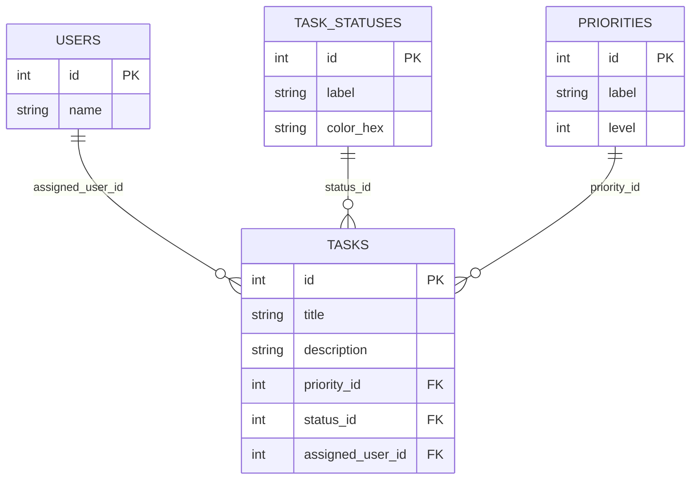
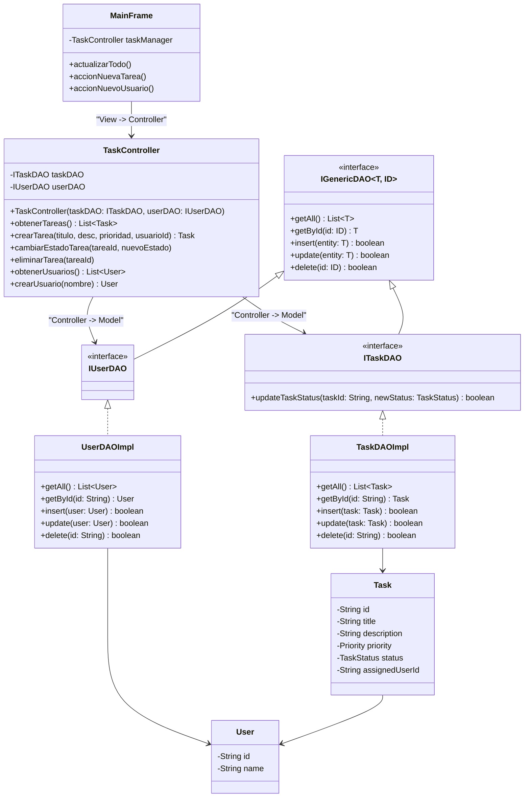

# Gestor de Tareas Avanzado (TaskFlow)

Este es un sistema de gestión de tareas diferente, rediseñado desde cero para aplicar conceptos avanzados de Programación Orientada a Objetos (POO), principios SOLID, uso de interfaces para abstraer la persistencia y conexión a base de datos mediante JDBC.

## Arquitectura y Principios Aplicados

El proyecto fue construido bajo el patrón arquitectónico **MVC (Model - View - Controller)** y principios de ingeniería de software robustos:

```
                  ┌─────────────────────────────────────┐
                  │              VISTA (View)           │
                  │       (com.taskflow.ui.MainFrame)   │
                  └──────────────────┬──────────────────┘
                                     │  Eventos / Acciones
                                     ▼
                  ┌─────────────────────────────────────┐
                  │       CONTROLADOR (Controller)      │
                  │   (com.taskflow.controller.        │
                  │         TaskController)             │
                  └──────────────────┬──────────────────┘
                                     │  CRUD / Negocio
                                     ▼
                  ┌─────────────────────────────────────┐
                  │            MODELO (Model)           │
                  │ - Entidades (com.taskflow.model)    │
                  │ - Acceso Datos (com.taskflow.dao)   │
                  │ - Conexión JDBC (com.taskflow.db)   │
                  └─────────────────────────────────────┘
```

1. **Modelo (Model)**: Encapsula las entidades (`Task`, `User`, `Priority`, `TaskStatus`) y la persistencia de datos mediante interfaces DAO e implementaciones JDBC (`TaskDAOImpl`, `UserDAOImpl`, `DatabaseConnection`).
2. **Vista (View)**: Diseñada en Swing (`MainFrame`) encargada de renderizar la interfaz visual, tableros Kanban y formularios sin acoplamiento a consultas SQL directas.
3. **Controlador (Controller)**: `TaskController` procesa las peticiones del usuario recibidas desde la Vista, aplica validaciones y orquesta las operaciones CRUD sobre el Modelo.
4. **POO y Abstracciones**: Uso de interfaces DAO genéricas (`IGenericDAO<T, ID>`, `ITaskDAO`, `IUserDAO`) para desacoplar completamente la lógica.
5. **SOLID (Inversión de Dependencias)**: El controlador recibe abstracciones por inyección de dependencias en el constructor.
6. **JDBC**: Conexión eficiente a MySQL con gestión de recursos, sentencias preparadas (*PreparedStatements*) y manejo de transacciones.

---

## 1. Flujo Conceptual y Modelo Entidad-Relación (E-R)

### Flujo Conceptual del Sistema


### Modelo Entidad-Relación (E-R) / Lógico


#### Interpretación y Geometría del Modelo E-R (Notación Chen)
El diagrama superior utiliza la **Notación de Chen** tradicional, donde cada figura geométrica cumple un propósito semántico en el modelado de datos:

| Figura Geométrica | Concepto E-R | Elementos en el Diagrama | Descripción Semántica |
| :--- | :--- | :--- | :--- |
| 🟩 **Rectángulos** | **Entidades** | `Person`, `TypePerson`, `Team`, `Task`, `StatusTask` | Representan los objetos reales o conceptuales independientes sobre los cuales se almacena información en el sistema. |
| 🔶 **Rombos** | **Relaciones** | `tiene_tipo`, `pertenece_a`, `asignado_a`, `tiene_estado` | Representan las asociaciones, verbos o dependencias lógicas entre dos o más entidades. |
| ⚪ **Círculos / Elipses** | **Atributos** | `id`, `name`, `username`, `title`, `description`, `priority` | Representan las propiedades o características atómicas que describen a cada entidad. |
| ➖ **Líneas de Enlace** | **Conexiones** | Enlaces entidad-relación y entidad-atributo | Definen la pertenencia de los atributos a sus entidades y la participación en las relaciones del negocio. |

##### Detalle de las Relaciones del Sistema:
1. **`Person` — `tiene_tipo` — `TypePerson`**: Cada persona u operario posee un tipo o rol específico dentro del sistema.
2. **`Person` — `pertenece_a` — `Team`**: Las personas se agrupan en equipos o departamentos de trabajo.
3. **`Person` — `asignado_a` — `Task`**: Una tarea es asignada directamente a una persona para su ejecución y seguimiento.
4. **`Task` — `tiene_estado` — `StatusTask`**: Cada tarea tiene asociado un estado puntual en el ciclo de vida de flujo (`TODO`, `IN_PROGRESS`, `DONE`).

---

El sistema gestiona Tareas (`Tasks`), Usuarios (`Users`), Estados (`TaskStatus`) y Prioridades (`Priority`). El modelo está diseñado y normalizado hasta la Cuarta Forma Normal (4NF) para asegurar integridad referencial y evitar dependencias multivaluadas.



---

## 2. Diagrama UML de Clases (Arquitectura MVC + Patrón DAO)

La estructura en código orientada a objetos (POO) del sistema mapea el flujo de trabajo separando la Vista, el Controlador y el Modelo:



---

## 3. Base de Datos (Modelo Físico y Normalización)

### Diagrama del Modelo Físico (DrawSQL / DrawMySQL)


### Normalización (hasta 4NF)
- **1NF**: Columnas con valores atómicos (sin listas u objetos anidados en campos).
- **2NF**: No hay dependencias parciales dado que usamos una clave primaria simple (`id`).
- **3NF**: No hay dependencias transitivas; los datos paramétricos como los colores de los estados o niveles de prioridades están extraídos en sus propias tablas paramétricas (`task_statuses` y `priorities`).
- **4NF**: Se cumple, ya que no hay dependencias multivaluadas en una sola tabla de enlace (cada tarea tiene máximo un usuario, estado y prioridad).

### Reconstruir en DrawSQL / DrawMySQL
Para generar el modelo físico con exactitud:
1. Abre [DrawSQL](https://drawsql.app/).
2. Haz clic en **Import from SQL**.
3. Pega el contenido del script que encontrarás en `database.sql` dentro de este proyecto.

### Conexión Mediante DBeaver
1. En DBeaver, crea una nueva conexión **MySQL**.
2. Ingresa `localhost` como servidor y `3306` como puerto.
3. Conéctate con tu usuario/contraseña (ej. `root`).
4. Abre el editor SQL y corre el script `database.sql` para crear la base de datos `taskflow_db` y sus tablas.

---

## 4. Documentación Complementaria
Para mayor detalle técnico, consulta los documentos especializados en la carpeta `docs/`:
* [Diagramas UML de Clases y Secuencia](docs/UML_DIAGRAMS.md)
* [Justificación de Normalización hasta 4NF](docs/DATABASE_NORMALIZATION.md)
* [Guía de Configuración y Conexión en DBeaver](docs/DBEAVER_SETUP.md)
* [Modelo Relacional Formal y Notación DBML](docs/RELATIONAL_MODEL.md)

---

## Ejecutar la Aplicación

1. Asegúrate de tener tu servidor MySQL activo (XAMPP, MySQL Installer, o Docker) y ejecutar primero `database.sql`.
2. Puedes compilar el proyecto usando `compile.bat`.
3. Ejecútalo mediante `run.bat`.

