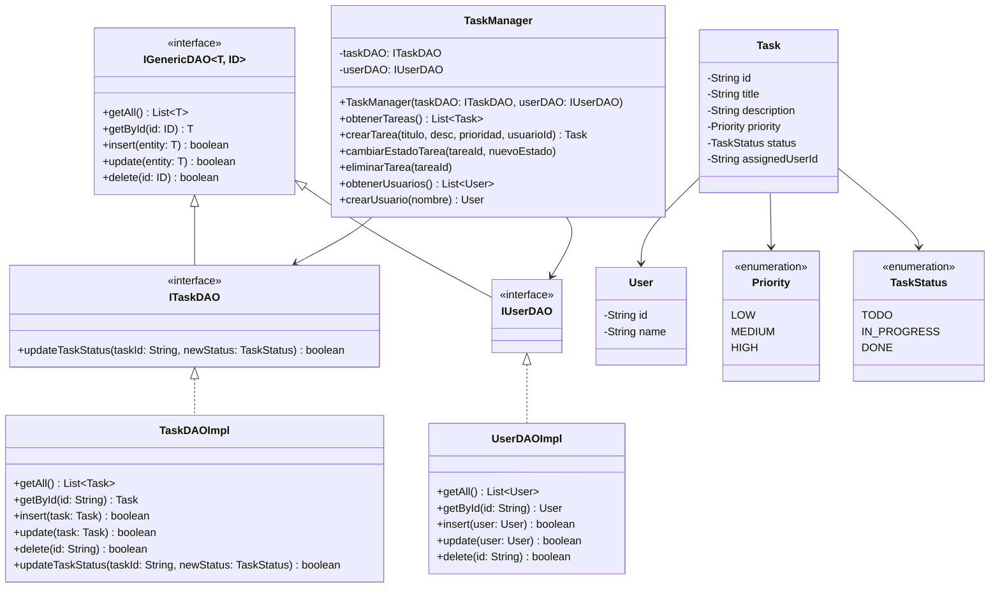

# Diagramas UML del Sistema TaskFlow

## 1. Diagrama de Clases

Este diagrama representa la estructura de clases del sistema, modelando las entidades de dominio y el desacoplamiento mediante interfaces DAO.

