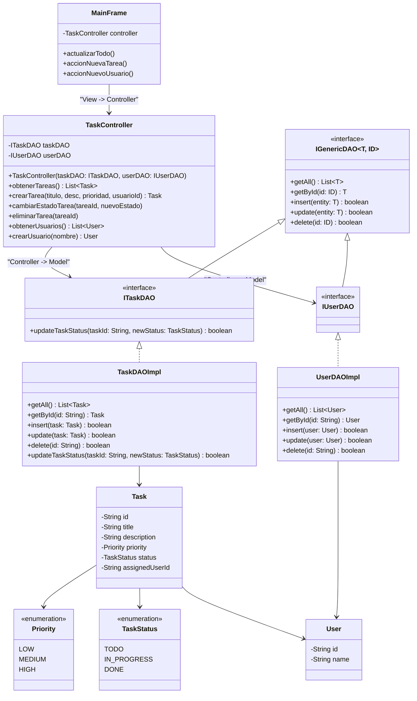

# Diagramas UML del Sistema TaskFlow (Arquitectura MVC)

## 1. Diagrama de Clases (MVC + DAO Pattern)

Este diagrama representa la estructura de clases del sistema bajo la arquitectura **Modelo - Vista - Controlador (MVC)**, modelando las entidades de dominio, el controlador y el desacoplamiento mediante interfaces DAO.

